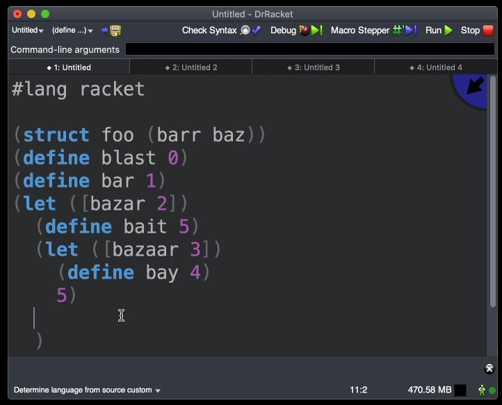
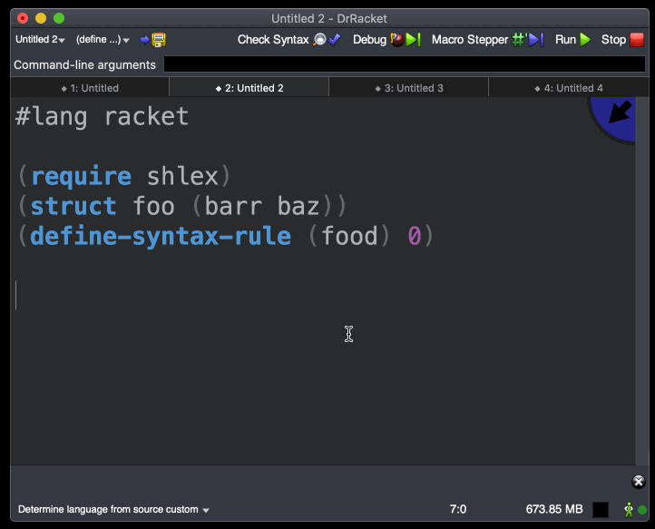
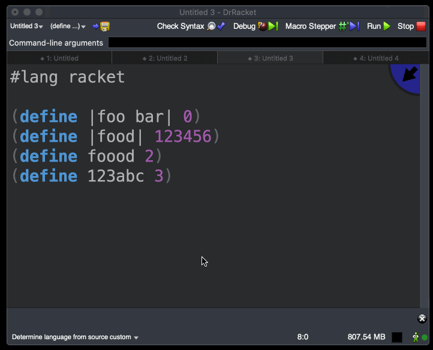

# Fishy Completion

This [Quickscript](https://docs.racket-lang.org/quickscript/) script allows users to autocomplete
an identifier via static analysis. 

To run the script, either use the menu or the keybinding (`ctrl ,` or `ctrl <`). Running repeatedly will cycle through all candidates (similar to the [dynamic completion](https://github.com/Metaxal/quickscript-extra/blob/master/scripts/dynamic-abbrev.rkt) in Quickscript Extra).

## Guarantee and limitation

The script guarantees that any autocompleted identifier at a position will definitely be in scope (according to [Check Syntax](https://docs.racket-lang.org/tools/Check_Syntax.html)), but it does not guarantee that it will be able to recognize every candidate identifier in the scope. For example, identifiers that are imported from other modules, either explicitly (e.g., via `require`) or implicitly (e.g., via `#lang`) are not supported. To autocomplete identifiers from other modules, use the built-in autocomplete feature in DrRacket (`ctrl .`).

In order to run the completion, the program must not have any compile-time error. However, this is too strict because the fact that you intend to use autocompletion probably means that the current program contains invalid identifiers (and thus compile-time errors). Therefore, errors that are caused by the identifier at the current position (i.e., attempting to use non-identifier macro as an identifier macro) and unbound identifiers are tolerated as special cases. Other errors such as unbalanced parentheses or errors in macro expansion will disable the completion.

## Demo

Fishy completion can be used to autocomplete any identifiers that are defined in a module.
Autocompleted identifiers are guaranteed to be in scope.

Fishy completion recognizes non-apparent bindings such as those generated from the `struct` form. It also recognizes macros. Note that it does not recognize identifiers imported from other modules. Use the built-in autocomplete feature in DrRacket for that case.

Fishy completion can autocomplete quoted identifiers and identifiers that start with a number.

If the current position is not associated with any token that could become an identifier, or if there is no candidate that could be in scope (up to the limitation described above), fishy completion will disable itself. 

When there is a compile-time error, fishy completion will disable itself. There are a few exceptions as described above.

